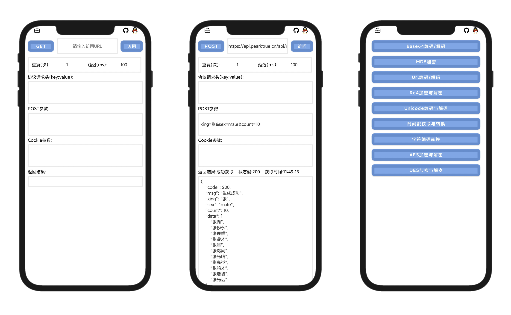

# PearHTTP - Android Network Testing Request Tool

PearHTTP is a network testing request tool for the Android platform. It supports GET, POST, PostJson requests, and file uploads, along with the capability to include Header and Cookie parameters.

## Features

- Supports various types of HTTP requests, including GET, POST, PostJson, and file uploads.
- Allows customization of request Headers and Cookie parameters.
- Provides a simple and user-friendly API interface for testing.
- Compatible with various versions of the Android platform.
- Offers a range of encoding, encryption, and decryption features.
- Supports usage of constants like timestamps, UUIDs, etc.

## Download & Installation

The open-source code may be outdated compared to the Releases version. It is recommended to download the latest version.

You can directly download the latest version from the Releases on the right -> [Releases](https://github.com/PearNoDec/PearHTTP/releases/)

For domestic users in China, download here -> [Access Code: eqbb](https://pearno.lanzouj.com/iRAgb173bcni)

## Self-Deployment

This open-source project is packaged with Andlua and FasionAPP2. If interested, you can self-deploy for learning purposes.

## Contribution Guidelines

If you would like to contribute to PearHTTP, you can follow these steps:

1. Fork this repository to your own GitHub account.
2. Create a new branch and make your changes there.
3. Push your changes to your GitHub repository.
4. Create a Pull Request to merge your changes into the main repository.

Please make sure your contributions adhere to the project's coding standards and provide appropriate test cases.

## License

[MIT](LICENSE) © PearNo

If you have any questions or suggestions regarding PearHTTP, feel free to ask. Thank you for your interest and support in this project!
